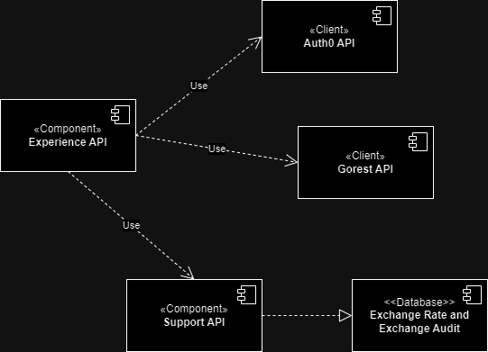
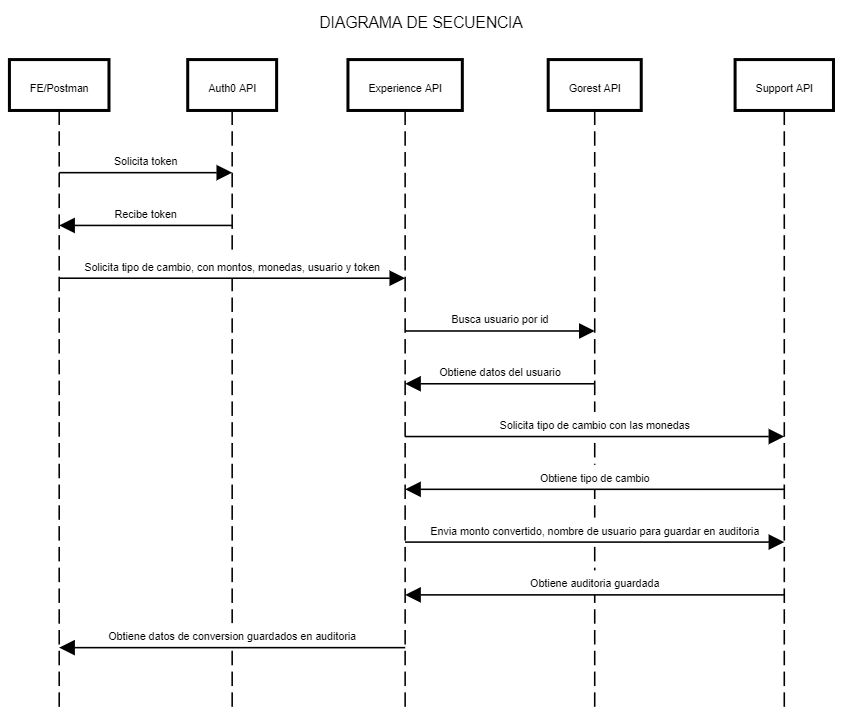

# reto-pichincha-mdelacruzp

### **Diagrama de componentes**

### **Diagrama de secuencia**

### **Instrucciones para levantar el proyecto**
1. Abrir los proyectos **experience-microservice** y **exchange-rate-microservice** con IntelliJ
2. Ejecutar la clase principal de ambos proyectos

### **Instrucciones para probar el flujo**
Se adjunta coleccion **Reto BackEnd - Pichincha.postman_collection.json**, importarlo en Postman
1. Ejecutar el request **1. OAuth2 Token - Auth0** , este devolverá un token
2. Ejecutar el request **2. Gorest - Obtener Usuarios** y guardar un id de los usuarios obtenidos
3. Ejecutar el request **3. Experience API - Realizar tipo de cambio**, usando el token del paso 1 en Authorization de tipo Bearer, y el id de usuario escogido en el paso 2 en el body en el atributo **userId**

Se agregaron otros request para probar funcionalidades especificas del API de Soporte

